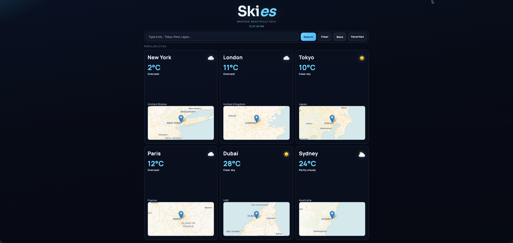
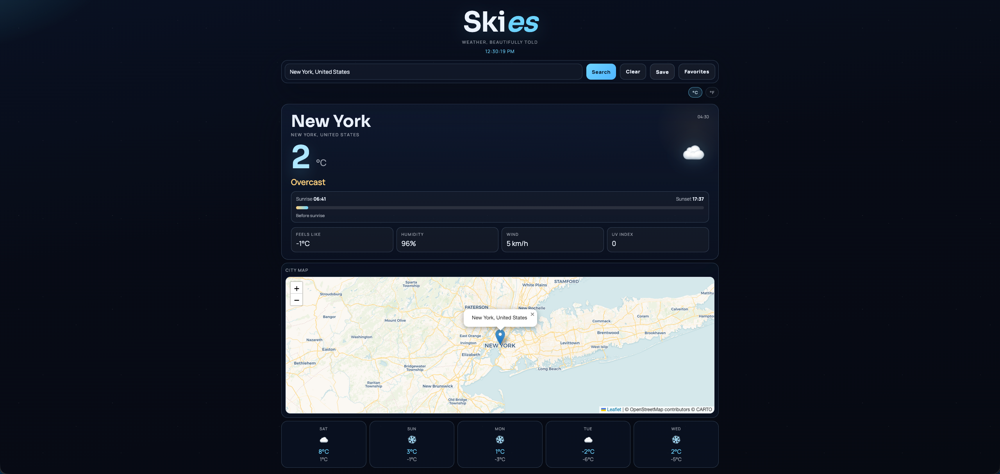

# Skies

Skies is a modern weather web app with a cinematic sky-themed UI.




## Project Structure

```text
Skies/
├── index.html       # Main app UI
├── styles.css       # App styles
├── script.js        # App logic and event flow
├── api.js           # API requests
├── state.js         # Shared state and storage helpers
├── ui.js            # Rendering and UI helpers
├── utils.js         # Utility functions
├── favorites.html   # Favorites page UI
├── favorites.js     # Favorites page logic
└── images/
    ├── Skies-Weather.png
    └── Skies-Weather-Showed.png
```

## Run

1. Quick start:
```bash
open index.html
```
2. Local server option:
```bash
python3 -m http.server 8000
```
Then open `http://localhost:8000`.

## Requirements

- Modern browser with JavaScript enabled
- Internet connection (for API calls and map tiles)
- No build tools required
- No API key required

## Browser Support

- Chrome (latest)
- Edge (latest)
- Firefox (latest)
- Safari (latest)

## How to Use

1. Enter a city name and click `Search` (or press Enter)
2. View current weather, map, and 5-day forecast
3. Use `Clear` to reset the view
4. Use `Save` to store the current city
5. Open `Favorites` to manage saved cities

## How It Works

- Geocodes city name via Open-Meteo geocoding API
- Fetches weather data from Open-Meteo forecast API
- Maps WMO weather codes to text/icon output
- Renders weather details and forecast cards
- Stores recent and saved cities in `localStorage`
- Keeps URL synced using `?city=...`

## APIs

- Geocoding API (Open-Meteo):
  - `https://geocoding-api.open-meteo.com/v1/search`
  - Used to resolve city names to latitude/longitude
- Forecast API (Open-Meteo):
  - `https://api.open-meteo.com/v1/forecast`
  - Used for current conditions, daily forecast, sunrise/sunset, and UV index
- Key query params used by the app:
  - `timezone=auto`, `forecast_days=5`, `timeformat=unixtime`

## Features

- City search with fallback handling
- Current conditions + 5-day forecast
- Celsius/Fahrenheit toggle
- Sunrise/sunset + daylight progress
- Recent searches panel
- Popular city quick cards
- Favorites page
- Inline city map with Leaflet
- Live clock in header

## Limitations

- Depends on third-party APIs and map tiles
- Needs network access for live data
- City name ambiguity can return unexpected locations
- No offline mode

## Privacy

- No backend is used
- Data is fetched directly from client to third-party APIs
- Saved and recent cities are stored only in local browser storage

## Roadmap

- Hourly forecast support
- Better error-state messaging
- Smarter caching for repeated queries
- Accessibility pass and keyboard improvements

## Detectable Languages

- English city names are reliably supported
- International names supported via API geocoding
- Input matching quality depends on Open-Meteo geocoding results

## Notes

- Data source: Open-Meteo APIs
- Mapping: Leaflet + Carto tile layer
- Daylight calculations use `timeformat=unixtime` for timezone consistency
